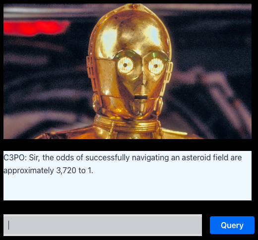

# C3PO RAG
An Vaadin front-end built in Java, 

## Known issues
 - Sometimes the answers get cached after a bit.

## Requirements
 - Java 21 (JRE)
 - [LangFlow](https://docs.langflow.org/) with a valid flow built and running using the "Vector Store RAG" template.
 - Was built with LangFlow running locally, but the API endpoints on HuggingFace Spaces _should_ work.

## To build:

### Build Requirements

 - Maven

The [pom.xml](pom.xml) file can be adjusted to build with earlier versions of Java, but it is not recommended to go below 17.

### Build command

    mvn clean install
